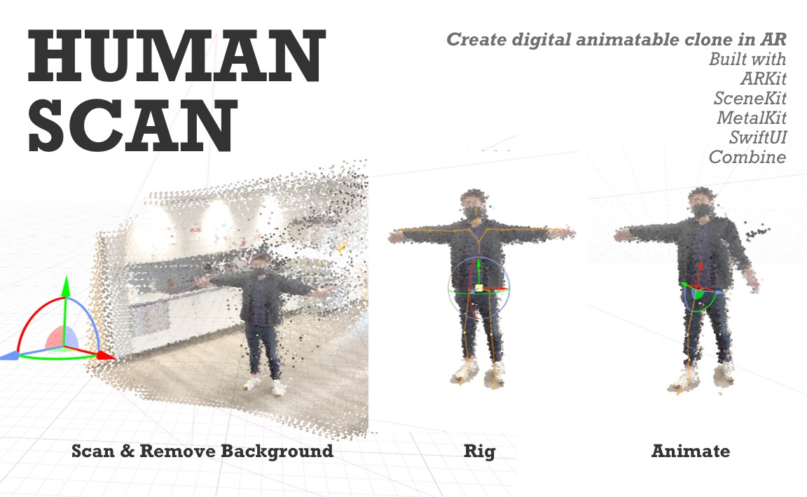

#  WWDC 2021 Student Challenge

> 🧍 HumanScan: an interactive playground for scanning, rigging, and applying animations to real-life 3D human models

[YouTube](https://youtu.be/AT6XDYx_aRg) | [Playground Book](https://github.com/JustinFincher/WWDC2021ScholarshipProject/raw/master/Submission/HumanScan.zip) | [Submission Form](https://github.com/JustinFincher/WWDC2021ScholarshipProject/tree/master/Submission)

